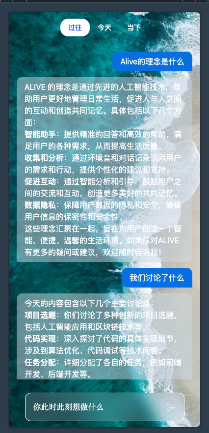
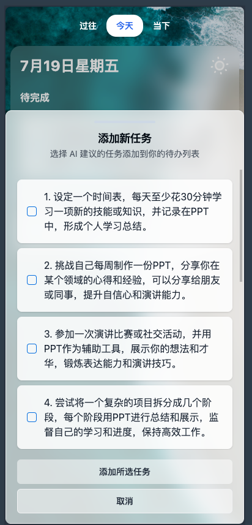
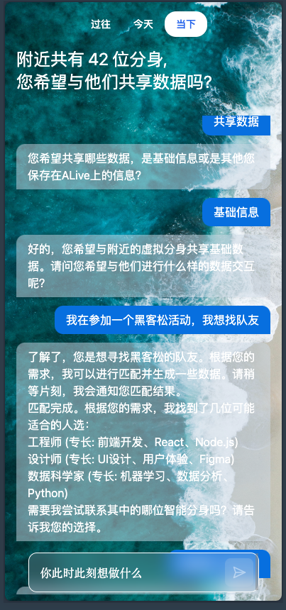
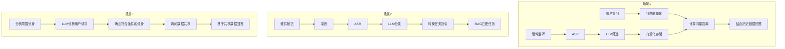

# ALIVE BOND AI WEARABLE

ALIVE BOND 是一款优雅、轻便的穿戴式设备，通过AI收集和共享个人数据，促进人与人之间的连接。它不仅记录你的日常生活，还帮助你回忆过去，并通过数据共享来创造共同记忆。

## 团队介绍

ALIVE BOND 是我们在黑客松期间共同开发的创新项目。每位团队成员都发挥了自己的专长，为项目贡献了独特的价值：

### Luke - 产品战略与设计
- 担任：资深AI产品经理
- 主要贡献：
    - 进行深入的竞品市场分析，确定产品定位和差异化策略
    - 设计产品核心功能和用户体验流程
    - 创作引人入胜的产品介绍视频和营销海报
    - 协调团队资源，确保项目按时完成各个里程碑

### [Kirk Lin](https://github.com/kirklin) - 技术架构与实现
- 担任：全栈开发工程师
- 主要贡献：
    - 设计并实现产品的前端界面，确保流畅的用户交互体验
    - 开发后端系统，实现数据处理和存储功能
    - 集成和优化AI RAG（检索增强生成）技术，提升产品的智能化水平
    - 负责系统架构设计，确保产品的可扩展性和性能

### [Charin](https://github.com/wing0night) - 硬件开发
- 担任：硬件工程师
- 主要贡献：
  - 设计ALIVE BOND的电路板，整合各种传感器和通信模块
  - 优化硬件性能，提高设备的续航能力和数据处理效率
  - 解决硬件集成过程中的各种技术难题
  - 确保硬件设计与软件需求的完美匹配

### [Yuansheng Chen](https://github.com/YuanshengC) - 工业设计与原型制作
- 担任：工业设计师
- 主要贡献：
    - 创作ALIVE BOND的外观设计，兼顾美观性和功能性
    - 使用3D建模软件完成产品的详细建模
    - 负责3D打印原型，实现快速迭代和优化
    - 设计人体工学穿戴方案，提升用户舒适度

我们的团队通过紧密协作，将AI技术、软件开发、产品设计和硬件工程等多个领域的专业知识融合在一起，共同打造了这款创新的AI穿戴设备。每位成员的贡献都是项目成功的关键因素，展现了他们在各自领域的专业能力和创新思维。

## 产品理念

在这个AI驱动的时代，人与人的连接变得尤为重要。ALIVE BOND不仅仅是一款用于收集个人数据并通过AI赋能的穿戴式设备，更是一个促进人与人之间连接的桥梁。通过数据共享，ALIVE BOND 赋予用户选择开放数据的权利，实现真正的数据共享。我们的理念是，在超级个体和小型团队成为新常态的背景下，更加注重人与人之间的连接。ALIVE BOND 不仅帮助个人提升生活品质，更致力于通过数据共享创造一个更加紧密和互联的社区。

## 产品核心功能/场景

### 场景1：

通过ALIVE硬件对环境音/用户对话进行记录，储存到云端AI分析后，用户基于需求对ALIVE进行意图输入，ALIVE将对应检索的结果返回至用户，基于用户意图解决用户的需求。/ 用户通过语音提问，chatbot界面回答，chatbot界面提问

### 场景2：

ALIVE从用户对话数据中，提取跟用户有关联的任务项，转化成可视化任务项供用户选择

### 场景3：

用户可自定义共享数据。用户进入到某个存在其他用户的区域，ALIVE设备自动感应周边共享数据，用户输入意图，AI对共享数据进行分析，基于用户意图进行反馈。

## 流程图

