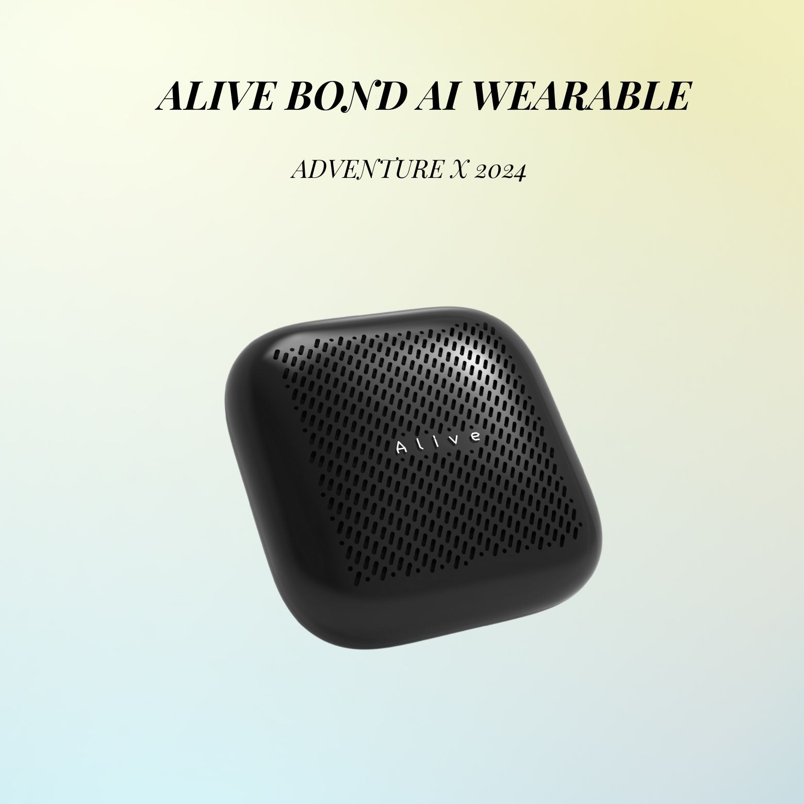

# ALIVE BOND AI WEARABLE

ALIVE BOND 是一款优雅、轻便的穿戴式设备，通过AI收集和共享个人数据，促进人与人之间的连接。它不仅记录你的日常生活，还帮助你回忆过去，并通过数据共享来创造共同记忆。

## 产品理念

在这个AI驱动的时代，人与人的连接变得尤为重要。ALIVE BOND不仅仅是一款用于收集个人数据并通过AI赋能的穿戴式设备，更是一个促进人与人之间连接的桥梁。通过数据共享，ALIVE BOND 赋予用户选择开放数据的权利，实现真正的数据共享。我们的理念是，在超级个体和小型团队成为新常态的背景下，更加注重人与人之间的连接。ALIVE BOND 不仅帮助个人提升生活品质，更致力于通过数据共享创造一个更加紧密和互联的社区。

## 产品核心功能/场景

### 场景1：

通过ALIVE硬件对环境音/用户对话进行记录，储存到云端AI分析后，用户基于需求对ALIVE进行意图输入，ALIVE将对应检索的结果返回至用户，基于用户意图解决用户的需求。/ 用户通过语音提问，chatbot界面回答，chatbot界面提问

### 场景2：

ALIVE从用户对话数据中，提取跟用户有关联的任务项，转化成可视化任务项供用户选择

### 场景3：

用户可自定义共享数据。用户进入到某个存在其他用户的区域，ALIVE设备自动感应周边共享数据，用户输入意图，AI对共享数据进行分析，基于用户意图进行反馈。

## 流程图

